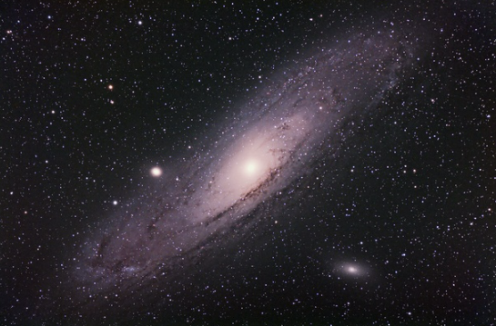
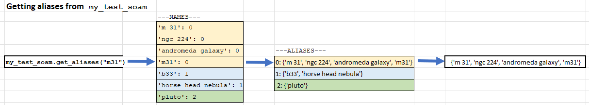
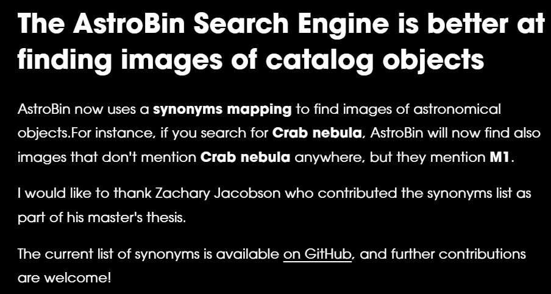

# Space-Object-Alias-Map (SOAM) Data Structure and Synonym File Creation

**Salvatore Iovene's Website**: https://app.astrobin.com/explore/iotd-tp-archive#iotd

## OBJECTIVE
I have provided a Haystack ElasticSearch synonyms file to Salvatore Iovene's open source AstroBin website improving its ability to search for images of space objects either by name or by a catalogue ID.

## PURPOSE
With millions of astronomical objects listed across 14,000+ catalogues it can be quite difficult call a space object by just one name. Is that M 31 or is that the Andromeda Galaxy... or is it NGC 224? [hint: yes, yes, and yes]

A synonym file containing each space object alias will help AstroBin's search engine return the desired photos of the specified space object no matter which naming convention the user searches by.



**Photo Credit**: "M31 180 sec final copyL" KevC (user name), 2011 https://www.astrobin.com/304/?q=m31 

**A Note on the SOAM:** The homemade SOAM ("Space Object Alias Map") class is a data structuring tool that can dynamically build and manage alias associations for individual objects.

## APPROACH
First, I wrangled up some starting "seed aliases" from the web. See `AstroCatelogues.xlsx`. Common space object IDs were compiled with some cross references from the following catalogues:

**Catalogues included in "Seed Aliases":**
* Caldwell
* Messier
* Sharpless
* Gum
* Galactic Wolf Rayet

Then using the following data sources I took advantage of overlapping associations between these data and built up a homemade data structure called a SOAM:

**Data Sources:**
* Wrangled "seed aliases" from `AstroCatelogues.xlsx`
* Identified NGC, IC, and HD catalogue IDs scraped from over 60K Astrobin image titles (`astrobin_titles_to_subject_types.csv`)
* Accessed the SIMBAD database using a homemade queue with astropy, the scraped IDs were fed to the SIMBAD database API and returned associated aliases of those IDs, see `ngc_ic_hd_associations_data.json`

**Examples of a SOAM data structure:**

*CODE EXAMPLE*:

``` Code:
t = Soam()
cleaned_bulk = 
[["a","b","c"],["c","d"],["e","f"]] # snippits of fractured associations (not fully associated yet)
t.add_associations(cleaned_bulk)
print(t.all_names())
print(t.all_aliases())
print(f"'c' is also known as {t.get_aliases('c')}")

#RETURNS:
#    {'d': 0, 'b': 0, 'a': 0, 'c': 0, 'f': 1, 'e': 1}
#    {0: {'d', 'b', 'a', 'c'}, 1: {'f', 'e'}}
#    'c' is also known as {'d', 'b', 'a', 'c'}
```

*VISUAL EXAMPLE*:


... see the `building_the_soam.ipynb` notebook for full details. 

Once the final SOAM structure was built, key space object names and IDs found in the Astrobin image titles data were identified and the aliases of those key space objects were included in the final solr formatted synonym file. See the `building_the_synonym_file.ipynb` notebook for full details. 

## KEY FINDINGS
* The final SOAM data structure is found in `data\soam_cleaned_bulk_export.json` and contains 25,631 names and aliases mapped across 4,264 different space objects.

* The final synonym file is found in `data\astrononimcal_synonyms_030825.txt` and contains 556 different space objects (this is what was provided to the Astrobin website)

## CONSIDERATIONS
* Unfortunately, in the SOAM, there were some pockets where the associations fed into the SOAM were incorrect (stemming from SIMBAD database). I've corrected what I could, but other pockets may still be in there, unknown to me.

* The synonyms file is in solr format and was trimmed back / focused on only 556 space objects out of the 4,264 that were available in the SOAM.

## FINISHED PRODUCT




https://welcome.astrobin.com/blog/december2023-update#:~:text=who%20contributed%20the-,synonyms%20list,-as%20part%20of
